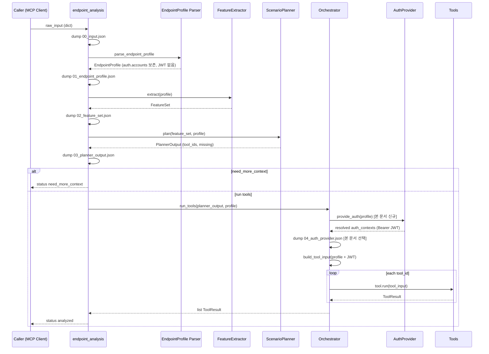

# VA-MCP 토큰발급 문서 (Auth Provider · 입력 계약 확장)

> **작성일**: 2026.05.18  
> **작성자**: 이윤재  
> **기준 코드**: `src/va_mcp/services/endpoint_analysis.py` (V3.1 구현)  
> **선행 문서**: [MCP_ARCHITECTURE_V3.md](./MCP_ARCHITECTURE_V3.md), [MCP_IMPLEMENTATION_GUIDE.md](./MCP_IMPLEMENTATION_GUIDE.md), [endpointProfile.md](../endpointProfile.md)  
> **버전**: 4.0.0

본 문서는 V3 파이프라인을 유지하면서, **계정 기반 로그인 → JWT 발급**을 Orchestrator 직전에 넣고, **사용자 입력 `auth` 블록**과 **`required_roles`** 메타데이터를 공식화한다.

---

## 0. V3 대비 변경 요약

| 항목                   | V3 (현재 구현)                                                              | 본 문서 (목표)                                                 |
| ---------------------- | --------------------------------------------------------------------------- | -------------------------------------------------------------- |
| 인증 입력              | `auth_contexts[]`에 **이미 발급된** bearer만                                | `auth.login` + `auth.accounts[]` **또는** 기존 `auth_contexts` |
| 토큰 발급 위치         | 호출자(Cursor/스크립트)가 login 후 JWT 전달                                 | **Orchestrator 직전 `AuthProvider`** (HTTP login)              |
| `EndpointProfile` 파서 | HTTP 없음 (순수 파싱)                                                       | **동일** — 파서는 토큰 발급하지 않음                           |
| `has_role_restriction` | FeatureSet 필드 존재, **extract에서 미설정**(항상 false)                    | `required_roles` 메타데이터로 설정                             |
| SQLi 선정              | `userId` 등 id형 query는 `has_free_text_input` false → sql_injection 미선정 | 본 문서 부록: 플래너 보완 후보 (`has_identifier_input` 등)     |
| 산출물                 | `00`~`03` + tool 결과                                                       | `04_auth_provider.json` 추가 (선택 dump)                       |

---

## 1. 시스템 정의 (V3 계승)

VA-MCP = OWASP 기반 API 취약점 분석 엔진 + MCP 인터페이스

핵심 원칙:

- Core Engine은 MCP에 종속되지 않는다.
- **파싱(EndpointProfile)과 실행(Orchestrator/Tools)을 분리**한다.
- 분석 로직은 Feature 기반으로 동작한다 (path는 보조 신호).
- 불완전 입력을 허용하고, Planner가 `need_more_context` / `missing`으로 보강 지점을 알린다.
- **본 문서 추가**: 사용자는 계정(id/pw)만 제공할 수 있고, JWT는 `AuthProvider`가 발급한다.

---

## 2. `analyze_endpoint` 전체 흐름 (본 문서)



### 2.1 단계별 책임

| 순서 | 모듈                        | HTTP        | 산출물 파일                       |
| ---- | --------------------------- | ----------- | --------------------------------- |
| 1    | `parse_endpoint_profile`    | ❌          | `01_endpoint_profile.json`        |
| 2    | `FeatureExtractor.extract`  | ❌          | `02_feature_set.json`             |
| 3    | `ScenarioPlanner.plan`      | ❌          | `03_planner_output.json`          |
| 4    | `AuthProvider.provide_auth` | ✅ login만  | `04_auth_provider.json` (본 문서) |
| 5    | `Orchestrator.run_tools`    | ✅ (도구별) | `tools/<tool_id>.json`            |

**중요**: `00_input.json`은 사용자가 보낸 **원본**을 그대로 보존한다. `AuthProvider`로 얻은 JWT는 `04_*` 또는 run 로그에만 남기고, `00_input`을 덮어쓰지 않는다 (비밀번호·토큰 유출 방지 정책은 OBSERVABILITY 문서와 통일).

---

## 3. 사용자 입력 (`raw_input`)

MCP `analyze_endpoint`의 `input` 인자 = 외부 JSON dict. 본 문서 권장 스키마는 **분석 대상 API 한 건**을 표현한다.

### 3.1 필수 필드

| 필드       | 타입   | 설명                                  |
| ---------- | ------ | ------------------------------------- |
| `base_url` | string | 절대 URL (`http://localhost:4000`)    |
| `method`   | string | `GET`, `POST`, …                      |
| `path`     | string | `/api/enrollments/me` (선행 `/` 권장) |

### 3.2 분석 대상 요청 스냅샷

| 필드      | 타입           | 기본 | 설명                                 |
| --------- | -------------- | ---- | ------------------------------------ |
| `headers` | object         | `{}` | 분석 대상 API 요청 헤더              |
| `query`   | object         | `{}` | 쿼리스트링                           |
| `params`  | object         | `{}` | path placeholder 치환용 (`{userId}`) |
| `body`    | object \| null | null | POST/PUT 바디                        |

### 3.3 권한·리소스 메타데이터

| 필드                     | 타입           | 기본     | 설명                                                                |
| ------------------------ | -------------- | -------- | ------------------------------------------------------------------- |
| `auth_required`          | bool           | false    | **서버가** 이 API에서 인증을 강제하는지 (문서/가드 기준)            |
| `required_roles`         | string[]       | `[]`     | 이 API 접근에 **필요한 역할** (명시). `has_role_restriction` 판단용 |
| `resource_context`       | object \| null | null     | IDOR/BOLA용 리소스·파라미터 지도 (§3.5)                             |
| `side_effect`            | string         | `"read"` | `read` \| `create` \| `update` \| `delete`                          |
| `returns_sensitive_data` | bool           | false    | 민감 데이터 응답 여부                                               |
| `description`            | string         | `""`     | 행위 설명 (FeatureExtractor 보조 힌트)                              |

### 3.4 인증 입력 — 본 문서 `auth` 블록 (신규, 권장)

기존 V3 `auth_contexts`(발급된 토큰)와 **병행** 가능. 우선순위는 구현 시 정의:

1. `auth_contexts`에 bearer가 이미 있으면 → **AuthProvider 스킵**
2. 없고 `auth.accounts`가 있으면 → **AuthProvider 실행**
3. 둘 다 없으면 → 비인증 ToolInput

```json
"auth": {
  "login": {
    "path": "/api/auth/login",
    "method": "POST",
    "credential_fields": {
      "username": "username",
      "password": "passwordHash"
    },
    "token_json_path": "accessToken"
  },
  "accounts": [
    {
      "username": "김민수",
      "password": "student1",
      "role": "student"
    },
    {
      "username": "이서연",
      "password": "student1",
      "role": "student"
    }
  ]
}
```

| `auth.login` 필드   | 설명                                                        |
| ------------------- | ----------------------------------------------------------- |
| `path`              | 로그인 API 경로 (global prefix 포함, 예: `/api/auth/login`) |
| `method`            | 보통 `POST`                                                 |
| `credential_fields` | §3.4.1 — AuthProvider가 login body를 조립할 때 사용         |
| `token_json_path`   | §3.4.2 — login 응답에서 JWT를 꺼낼 때 사용                  |

#### 3.4.1 `credential_fields` — 왜 필요한가

AuthProvider은 `auth.accounts[]`의 값을 **그대로** HTTP body에 넣지 않는다.  
프로젝트마다 로그인 DTO 필드명이 다르기 때문에, **엔진 내부 논리 키 → 실제 JSON 키** 매핑이 필요하다.

| 논리 키 (엔진 고정) | `broken_regist` 실제 키 | 다른 API 예시        |
| ------------------- | ----------------------- | -------------------- |
| `username`          | `username`              | `email`, `userId`    |
| `password`          | `passwordHash`          | `passwd`, `password` |

`accounts` 항목은 항상 동일한 shape를 쓴다:

```json
{ "username": "김민수", "password": "student1", "role": "student" }
```

`AuthProvider`가 조립하는 **실제 login 요청 body** (`broken_regist`):

```json
{
  "username": "김민수",
  "passwordHash": "509e87a6c45ee0a3c657bf946dd6dc43d7e5502143be195280f279002e70f7d9"
}
```

(`password`에는 시드/문서 기준으로 서버가 기대하는 **해시 문자열**을 넣는다. 평문 `student1`이 아니라 SHA-256 hex를 넣어야 login이 성공하는 환경이면, 호출자가 그 값을 `accounts[].password`에 실어 보낸다.)

**이 필드가 없으면** MCP는 “username/password를 어느 키로 보내야 하는지”를 추측할 수 없고, `auth_type: basic`처럼 프로젝트마다 다른 관례에 하드코딩하게 된다. 본 문서는 **login 계약만 입력으로 받고** 나머지 API는 공통 `accounts` shape를 유지하기 위해 `credential_fields`를 둔다.

V3의 루트 `credential_fields`(EndpointProfile)와 **의미는 동일**하며, 본 문서에서는 login 전용으로 `auth.login` 아래에 둔다.

#### 3.4.2 `token_json_path` — 왜 필요한가

로그인 API마다 JWT가 들어 있는 **응답 JSON 경로**가 다르다.

| 프로젝트            | 응답 예시                                        | 추출 경로           |
| ------------------- | ------------------------------------------------ | ------------------- |
| `broken_regist`     | `{ "accessToken": "eyJ...", "refreshToken": … }` | `accessToken`       |
| (가칭) OAuth 스타일 | `{ "data": { "access_token": "…" } }`            | `data.access_token` |
| (가칭) 래핑 없음    | `{ "token": "…" }`                               | `token`             |

AuthProvider은 login HTTP **성공 후** 이 경로로 문자열을 읽어 `AuthContext(auth_type="bearer", token=…)`를 만든다.

**이 필드가 없으면** 엔진이 `accessToken` / `token` / `jwt` 등을 순서대로 guess해야 하고, guess 실패 시 모든 계정의 토큰 발급이 실패한다. 명시 경로는 **실패를 빠르게 드러내고** run 로그(`04_auth_provider.json`)에서 원인을 추적하기 쉽다.

점 표기(`data.access_token`)는 중첩 객체용이며, 구현 시 단일 키(`accessToken`)부터 지원해도 된다.

| `auth.accounts[]` 필드 | 설명                                                                            |
| ---------------------- | ------------------------------------------------------------------------------- |
| `username`             | 로그인 ID (프로젝트별: 이름, email 등)                                          |
| `password`             | 비밀번호 평문 또는 해시 필드 값 (`broken_regist`는 `passwordHash`에 넣는 값)    |
| `role`                 | Planner·도구가 쓰는 **테스트 역할 라벨** (서버 role claim과 동일할 필요는 없음) |

### 3.5 `resource_context` (V3 계승, 정규화 후 shape)

**역할**: “무엇을 / 어떤 요청 키로 가리키는가” — **신원(auth)과 별개**.

| 키                | 필수     | 설명                                            |
| ----------------- | -------- | ----------------------------------------------- |
| `resource_type`   | ✅       | `enrollment`, `user`, `course` …                |
| `resource_id_key` | ✅       | 대상 식별 파라미터명 (`userId`, `enrollmentId`) |
| `owner_id_key`    | 선택     | 소유자와 일치해야 하는 키 (IDOR 가정)           |
| `tenant_id_key`   | 선택     | 테넌트 경계                                     |
| `hierarchy_keys`  | string[] | 상위→하위 리소스 경로                           |

`GET /api/enrollments/me` 예:

```json
"resource_context": {
  "resource_type": "enrollment",
  "resource_id_key": "userId",
  "owner_id_key": "userId"
}
```

### 3.6 본 문서 전체 입력 예시 (`broken_regist`)

```json
{
  "base_url": "http://localhost:4000",
  "method": "GET",
  "path": "/api/enrollments/me",
  "headers": { "Accept": "application/json" },
  "query": { "userId": "1" },
  "params": {},
  "body": null,
  "auth_required": false,
  "required_roles": [],
  "resource_context": {
    "resource_type": "enrollment",
    "resource_id_key": "userId",
    "owner_id_key": "userId"
  },
  "side_effect": "read",
  "returns_sensitive_data": true,
  "description": "내 수강 목록. userId가 SQL에 결합. JwtAuthGuard 없음.",
  "auth": {
    "login": {
      "path": "/api/auth/login",
      "method": "POST",
      "credential_fields": {
        "username": "username",
        "password": "passwordHash"
      },
      "token_json_path": "accessToken"
    },
    "accounts": [
      { "username": "김민수", "password": "student1", "role": "student" },
      { "username": "이서연", "password": "student1", "role": "student" }
    ]
  }
}
```

### 3.7 V3 호환 입력 (현재 동작)

```json
"auth_contexts": [
  { "role": "student_a", "auth_type": "bearer", "token": "<JWT>" },
  { "role": "student_b", "auth_type": "bearer", "token": "<JWT>" }
]
```

호출자가 이미 login 한 경우 `AuthProvider` 없이 그대로 Tool에 전달한다.

---

## 4. `EndpointProfile` (파서 출력)

파일: `endpoint_profile_parser.py` → `EndpointProfile` dataclass.

### 4.1 본 문서에서 추가·변경된 필드 (EndpointProfile — **구현됨**)

| 필드             | 타입                 | 설명                                                                 |
| ---------------- | -------------------- | -------------------------------------------------------------------- |
| `auth`           | `AuthConfig \| None` | 정규화된 `login` + `accounts` (`endpoint_profile_auth_normalizer`)   |
| `required_roles` | `list[str]`          | API 접근에 필요한 역할 메타데이터                                    |
| `auth_contexts`  | `list`               | V3와 동일; `provide_auth` **후** orchestrator에서 채울 예정 (미구현) |

파서 단계에서 **하지 않는 것**:

- login HTTP 호출
- `auth_contexts`에 JWT 주입 (`provide_auth` 전까지 비어 있거나 사용자가 준 bearer만)

### 4.2 `01_endpoint_profile.json` 예시 shape (본 문서 목표)

```json
{
  "base_url": "http://localhost:4000",
  "method": "GET",
  "path": "/api/enrollments/me",
  "query": { "userId": "1" },
  "auth_required": false,
  "required_roles": [],
  "resource_context": {
    "resource_type": "enrollment",
    "resource_id_key": "userId",
    "owner_id_key": "userId",
    "tenant_id_key": null,
    "hierarchy_keys": []
  },
  "auth": {
    "login": {
      "path": "/api/auth/login",
      "method": "POST",
      "credential_fields": { "...": "..." },
      "token_json_path": "accessToken"
    },
    "accounts": [{ "username": "김민수", "password": "***", "role": "student" }]
  },
  "auth_contexts": [],
  "side_effect": "read",
  "returns_sensitive_data": true,
  "credential_fields": {}
}
```

비밀번호는 dump 시 마스킹 정책 적용 (OBSERVABILITY). -> 개발 단계중 미적용

---

## 5. `FeatureSet` (FeatureExtractor 출력)

파일: `feature_extractor/extractor.py` → `FeatureSet`.

### 5.1 V3에서 이미 추출되는 항목

| Feature                   | 주요 판단                               |
| ------------------------- | --------------------------------------- |
| `has_user_input`          | body/query/params 존재                  |
| `has_free_text_input`     | 키가 `keyword`, `search`, `query`, …    |
| `has_enum_input`          | 키가 `status`, `role`, `type`, …        |
| `requires_auth`           | `profile.auth_required` 직접 반영       |
| `has_resource_identifier` | path `{param}` 또는 키가 `*id` / `*_id` |
| `is_state_changing`       | `side_effect` 또는 PUT/PATCH/DELETE     |
| `has_admin_feature`       | path에 `/admin` 등                      |
| `returns_sensitive_data`  | profile 직접 반영                       |

### 5.2 본 문서에서 추가·수정할 추출 (구현 TODO)

| Feature                | 본 문서 규칙                                                                                  |
| ---------------------- | --------------------------------------------------------------------------------------------- |
| `has_role_restriction` | `len(required_roles) > 0`                                                                     |
| `auth_account_count`   | `len(auth.accounts)` 또는 `len(auth_contexts)` (Planner 전용 신호, FeatureSet 필드 추가 권장) |
| `has_auth_accounts`    | `auth.accounts` 존재                                                                          |
| `has_identifier_input` | (플래너 보완) `userId`, `*Id` query/body → A05 `sql_injection` 후보                           |

**주의**: `auth.accounts`에 admin+student가 **둘 다 있다**고 해서 `has_role_restriction=true`가 되면 안 된다. 그것은 **테스트 계정 보유**이지 **API 역할 제한**이 아니다.

### 5.3 `02_feature_set.json` 예시 (`enrollments/me`)

```json
{
  "has_user_input": true,
  "has_free_text_input": false,
  "has_enum_input": false,
  "requires_auth": false,
  "has_resource_identifier": true,
  "has_role_restriction": false,
  "has_auth_accounts": true,
  "auth_account_count": 2,
  "is_state_changing": false,
  "returns_sensitive_data": true
}
```

---

## 6. `PlannerOutput` (ScenarioPlanner 출력)

파일: `planner/planner.py` → `PlannerOutput`.

```python
@dataclass
class PlannerOutput:
    owasp_candidates: list[str]   # 예: ["A01", "A02", "A05", "A10"]
    tool_ids: list[str]           # 실행할 tool_id 목록
    need_more_context: bool       # True면 Orchestrator 미실행
    missing: list[str]            # 예: ["auth_contexts"]
```

### 6.1 본 문서 Planner에서 `auth` 반영 (구현 TODO)

계정 개수 산정 (`auth_count`):

```
auth_count = max(
  len(profile.auth_contexts or []),
  len(profile.auth.accounts or []) if profile.auth else 0,
)
```

| Tool                            | 본 문서 선정 조건 (요약)                                                               |
| ------------------------------- | -------------------------------------------------------------------------------------- |
| `idor_bola`                     | `requires_auth` ∧ (`has_resource_identifier` ∨ `resource_context`) ∧ `auth_count >= 2` |
| `rbac_check`                    | `requires_auth` ∧ (`has_admin_feature` ∨ `has_role_restriction`) ∧ `auth_count >= 2`   |
| `bfla`                          | `requires_auth` ∧ (`has_admin_feature` ∨ `has_role_restriction`)                       |
| `forced_browsing`, `cors_check` | `requires_auth`                                                                        |
| `sql_injection`                 | `has_user_input` ∧ (`has_free_text_input` ∨ `has_enum_input` ∨ `has_identifier_input`) |
| A02/A10 baseline                | 조건 없이 항상 포함                                                                    |

`auth_required: false`인 API (`enrollments/me`):

- A01 도구는 **기본적으로 미선정** (문서·서버와 일치).
- `auth.accounts`가 있어도 **무인증 IDOR**(`?userId=`) 시나리오는 본 문서.1에서 별도 tool 또는 `parameter_tamper` 확장으로 다룸 (부록 A).

### 6.2 `03_planner_output.json` 예시

`auth_required: true`, 계정 2개, `resource_context` 있음:

```json
{
  "owasp_candidates": ["A02", "A01", "A04", "A05", "A10"],
  "tool_ids": [
    "security_headers",
    "cors_misconfiguration",
    "idor_bola",
    "forced_browsing",
    "cors_check",
    "sql_injection",
    "retry_handling"
  ],
  "need_more_context": false,
  "missing": []
}
```

계정 1개만 있고 `idor_bola` 조건 미충족:

```json
{
  "need_more_context": false,
  "missing": ["auth_contexts"],
  "tool_ids": ["...", "forced_browsing"]
}
```

`missing`은 “실행 불가”가 아니라 “IDOR 비교 도구를 돌리려면 계정 하나 더 넣어라”는 **보강 힌트**이다 (V3 계약 유지).

---

## 7. Orchestrator · AuthProvider (본 문서 핵심)

### 7.1 AuthProvider란

**도구 실행 직전**에 `auth.login` + `auth.accounts`로 JWT를 발급해 `auth_contexts`(Bearer)로 바꾸는 **전처리 모듈**이다.

- 제안 경로: `src/va_mcp/services/auth_provider.py`
- 함수: `provide_auth(profile: EndpointProfile) -> AuthProviderResult`

```python
@dataclass
class AuthProviderResult:
    auth_contexts: list[AuthContext]  # bearer JWT
    errors: list[dict]                # 계정별 login 실패
    skipped: bool                     # 이미 auth_contexts 있으면 True
```

### 7.2 실행 조건 (언제 login HTTP를 호출하는가)

| 조건                                                   | AuthProvider                         |
| ------------------------------------------------------ | ------------------------------------ |
| `planner_output.need_more_context == True`             | ❌ Orchestrator 즉시 return `[]`     |
| `auth_contexts`에 유효한 bearer가 1개 이상             | ❌ 스킵 (기존 토큰 사용)             |
| `profile.auth` 없음 또는 `accounts` 빈 배열            | ❌ 스킵 (비인증 ToolInput)           |
| `profile.auth.accounts` ≥ 1                            | ✅ **각 account마다 login 1회**      |
| 선정된 tool_ids 중 auth 필수 도구만 있고 accounts 없음 | 도구 실행 시 `skipped` (기존과 동일) |

`AuthProvider`는 **Planner가 고른 tool과 무관하게** “accounts가 있으면” 발급해도 된다 (캐시 reuse).  
최적화: `auth` 필요 tool이 하나도 없고 `auth_required==false`이면 발급 생략 가능 (정책 플래그 `provider_only_if_needed`).

### 7.3 Orchestrator 내부 순서 (본 문서)

```
run_tools(planner_output, profile):
  1. if planner_output.need_more_context: return []

  2. auth_ctxs = provide_auth(profile)      # [본 문서 신규]
     - dump 04_auth_provider.json (마스킹)
     - profile_work = profile with auth_contexts filled

  3. tool_input = build_tool_input(profile_work)

  4. for tid in planner_output.tool_ids:
         tool.run(tool_input)
     return results
```

**EndpointProfile 파서는 2번을 호출하지 않는다.**

### 7.4 AuthProvider 알고리즘 (상세)

```
for account in profile.auth.accounts:
  body = map_credentials(account, profile.auth.login.credential_fields)
  POST {base_url}{login.path}
  token = extract_json(resp, token_json_path)
  append AuthContext(role=account.role, auth_type="bearer", token=token)
return auth_contexts
```

실패 처리 (권장):

- 계정 단위 실패 → `errors`에 기록, 해당 role 제외
- 전부 실패 + idor_bola가 tool_ids에 포함 → 해당 도구는 `skipped` 또는 run-level warning

### 7.5 `build_tool_input` (변경 없음, 입력만 풍부해짐)

기존: `ep.auth_contexts` → `ToolInput.auth`  
본 문서: `provide_auth` 후 `auth_contexts`가 채워진 profile을 넘긴다.

도구별 `auth` 사용 (V3 계약):

| tool_id           | auth 개수                              |
| ----------------- | -------------------------------------- |
| `idor_bola`       | 2 (`auth[0]` 공격자, `auth[1]` 소유자) |
| `bfla`            | ≥ 1                                    |
| `rbac_check`      | 2                                      |
| `forced_browsing` | 0~1 (있으면 사용)                      |
| A02/A10 baseline  | 0                                      |

---

## 8. 구현 체크리스트 (V3 → 본 문서)

### 8.1 EndpointProfile

- [ ] `AuthConfig`, `LoginConfig`, `AccountCredential` dataclass
- [ ] `endpoint_profile_parser`: `auth`, `required_roles` 파싱·검증
- [ ] `endpoint_profile_validator`: login.path, accounts[].username 필수
- [ ] dump 시 password 마스킹

### 8.2 FeatureExtractor

- [ ] `has_role_restriction` ← `required_roles`
- [ ] `auth_account_count` / `has_auth_accounts` (선택)
- [ ] `has_identifier_input` + Planner sql_injection 연동 (부록 A)

### 8.3 Planner

- [ ] `auth_count`에 `len(auth.accounts)` 반영
- [ ] `auth_required:false` + 무인증 IDOR 시나리오 (부록 A)

### 8.4 AuthProvider + Orchestrator

- [ ] `services/auth_provider.py` 구현
- [ ] `orchestrator.run_tools` 시작부 `provide_auth` 호출
- [ ] `04_auth_provider.json` recorder hook
- [ ] 기존 bearer `auth_contexts` 우선 (스킵)

### 8.5 문서·테스트

- [ ] `endpointProfile.md` 본 문서 스키마 동기화
- [ ] `tests/endpoint_profile/test_auth_config.py`
- [ ] `tests/services/test_auth_provider.py` (mock login)
- [ ] `tests/orchestrator/test_auth_provider_integration.py`

---

## 9. 부록 A — `enrollments/me` 클래스 API (가드 없음)

| 현상                   | 설명                                                                                                                    |
| ---------------------- | ----------------------------------------------------------------------------------------------------------------------- |
| 서버                   | JwtAuthGuard 없음, `?userId=` 로 타인 목록 조회                                                                         |
| `auth_required: false` | 문서상 맞음                                                                                                             |
| V3/본 문서 A01         | `requires_auth`가 false면 `idor_bola` 미선정                                                                            |
| 본 문서.1 후보         | `has_auth_accounts`와 무관하게 `owner_param_tamper` tool 또는 `parameter_tamper`가 `resource_context.owner_id_key` 변조 |

이 API는 **AuthProvider가 JWT를 발급해도** 서버가 토큰을 무시할 수 있으므로, `AuthProvider`와 **무인증 파라미터 IDOR** 검증은 별도 시나리오로 유지한다.

---

## 10. 부록 B — V3 문서와의 관계

- V3.1 구현 세부(Scenario, ToolResult)는 유효하다.
- 본 문서는 **입력 계약(`auth`)** 과 **실행 전처리(AuthProvider)** 만 확장한다.
- 충돌 시 **본 문서 > V3** (인증 입력 부분).

---

## 11. 핵심 요약

```
User Input (auth.login + auth.accounts | auth_contexts)
  → EndpointProfile (파싱만, JWT 없음)
  → FeatureSet (required_roles → has_role_restriction)
  → PlannerOutput (auth_count로 idor_bola 등 선정)
  → AuthProvider (Orchestrator 직전, login → JWT)
  → ToolInput (bearer)
  → Tools → ToolResult
```

**토큰 발급은 EndpointProfile이 아니라 Orchestrator 직전 AuthProvider의 책임이다.**
